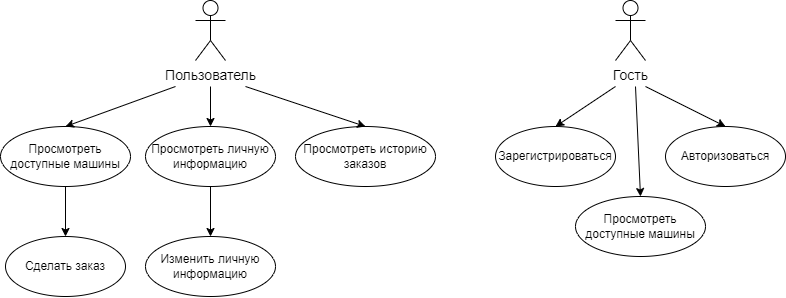
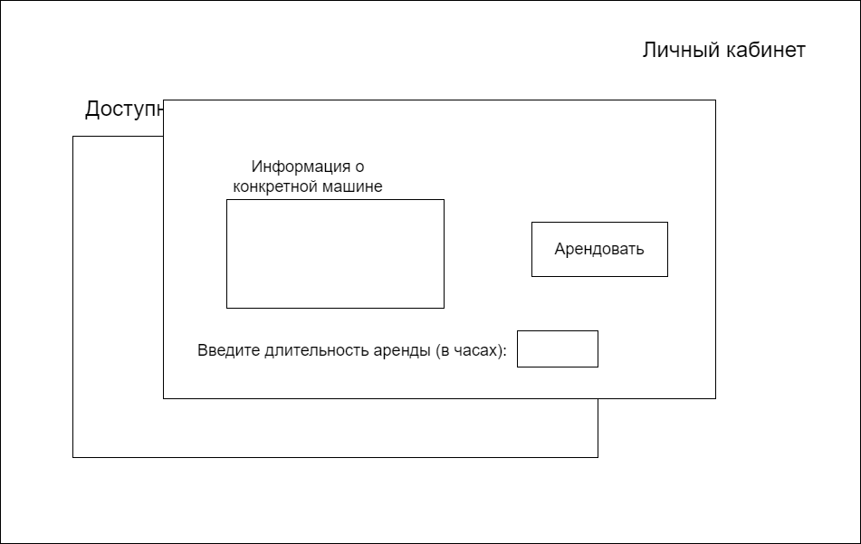
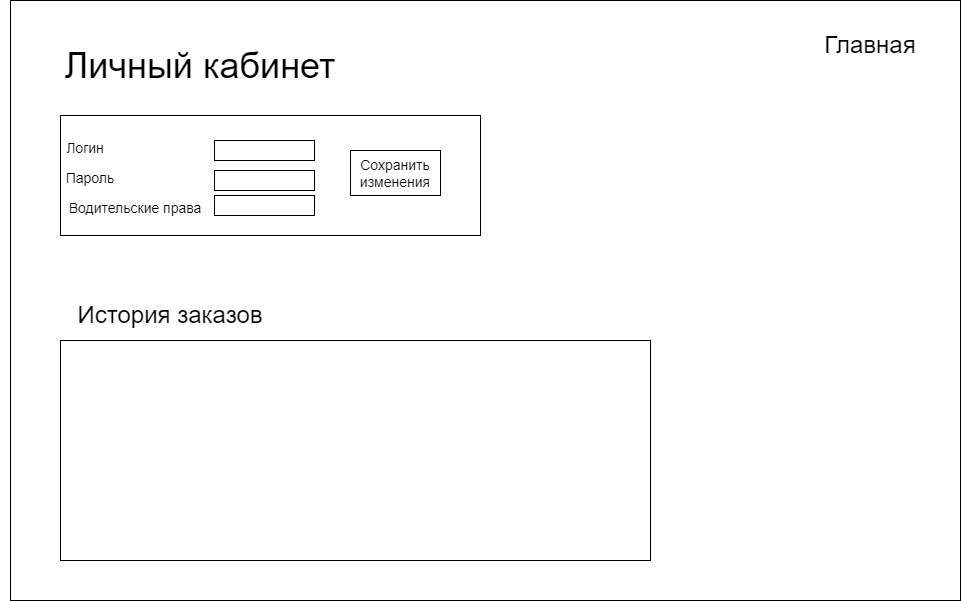
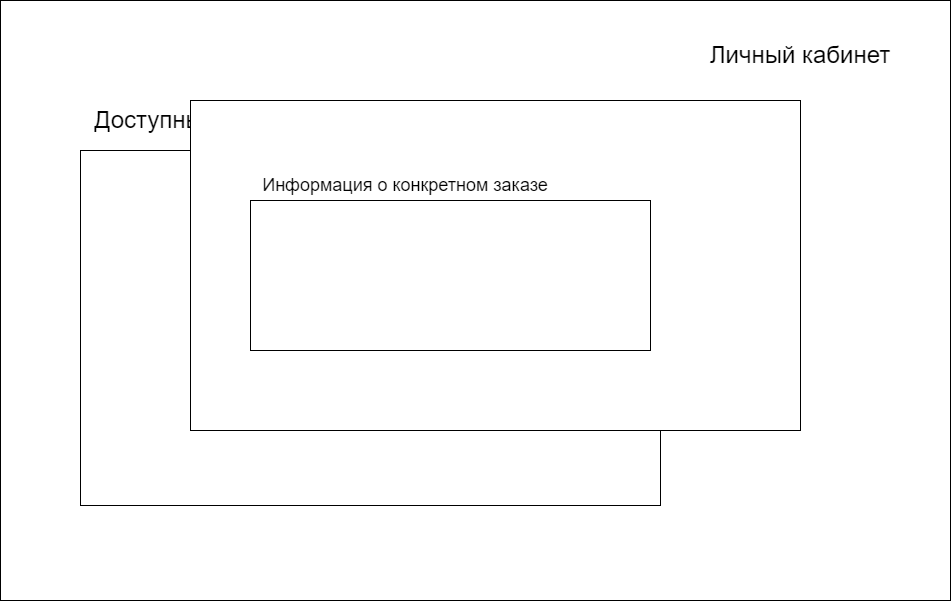
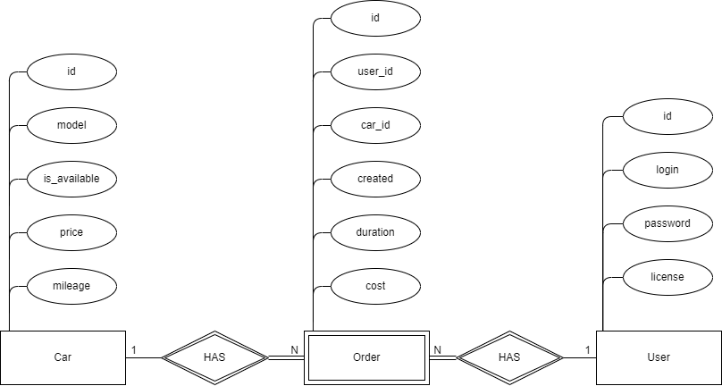

# DailyAuto - почасовая аренда автомобилей

## Цель работы
Разработка web-приложения для почасовой аренды автомобилей.

## Краткий перечень функциональных требований
- регистрация в системе;
- авторизация в системе;
- просмотр доступных автомобилей;
- создание новых заказов;
- просмотр и редактирование личных данных;
- просмотр истории заказов.

## Use-Case диаграмма


## Экраны будущего приложения

### Главная страница (гость)


### Главная страница (пользователь)


### Аренда машины


### Личный кабинет


### Просмотр заказа в истории


## ER-диаграмма сущностей


## Нагрузочное тестирование ApacheBenchmark
```
ab -n 10000 -c 500 http://127.0.0.1:80/api/v1/cars?offset=0&limit=10

This is ApacheBench, Version 2.3 <$Revision: 1903618 $>
Copyright 1996 Adam Twiss, Zeus Technology Ltd, http://www.zeustech.net/
Licensed to The Apache Software Foundation, http://www.apache.org/

Benchmarking 127.0.0.1 (be patient)
Completed 1000 requests
Completed 2000 requests
Completed 3000 requests
Completed 4000 requests
Completed 5000 requests
Completed 6000 requests
Completed 7000 requests
Completed 8000 requests
Completed 9000 requests
Completed 10000 requests
Finished 10000 requests


Server Software:        dailyauto
Server Hostname:        127.0.0.1
Server Port:            80

Document Path:          /api/v1/cars?offset=0
Document Length:        0 bytes

Concurrency Level:      500
Time taken for tests:   11.271 seconds
Complete requests:      10000
Failed requests:        0
Total transferred:      765714 bytes
HTML transferred:       0 bytes
Requests per second:    887.22 [#/sec] (mean)
Time per request:       563.558 [ms] (mean)
Time per request:       1.127 [ms] (mean, across all concurrent requests)
Transfer rate:          66.34 [Kbytes/sec] received

Connection Times (ms)
              min  mean[+/-sd] median   max
Connect:        0    0   0.4      0       8
Processing:     3  547 577.5    364    4116
Waiting:        0  534 580.7    358    4107
Total:          4  547 577.5    365    4116

Percentage of the requests served within a certain time (ms)
  50%    365
  66%    583
  75%    781
  80%   1043
  90%   1514
  95%   1771
  98%   1983
  99%   2112
 100%   4116 (longest request)
 ```
